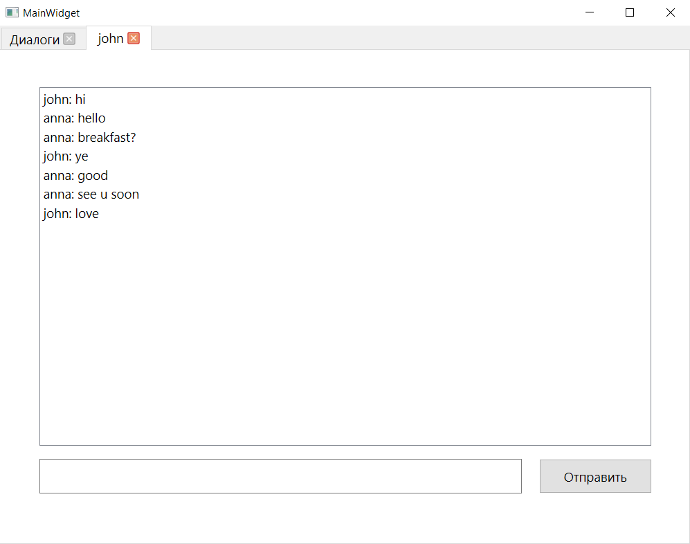

# Мессенджер

Мессенджер, работающий по протоклу TCP.

Топология подключения клиентов - звезда (один сервер, который знает всё и обо всех клиентах).

1. Поддерживается авторизация и регистрация пользователей
2. Отправка и прием текстовых сообщений
3. Хранение истории сообщений

Для графического интерфейса клиента используется Qt.

---

    
<code><h3>Сборка проекта</h3></code>

Для сборки проекта необходимо наличие следующих библиотек и зависимостей:
- Qt6
- boost 1.81.0 или новее
- postgreSQL
- libpqxx
- Cmake версии 3.5 или новее

Для настройки проекта необходимо:
- Создать базу данных postrgesql `messenger`
- Запустить для создания структуры БД файл `MEGAADDER.sql`
(содержится в проекте Server)
- Указать свои данные, используемые для подключения к БД, в
файле `databaseManager.h`
- Для изменения адреса и порта необходимо:
    - Изменить аргумент конструктора объекта Server в файле `main.cpp` проекта Server
    - Указать адрес и порт в файле `config.json` проекта Client

Описание структуры проекта:
- Client содержит файлы:
    - `main.cpp` – главный файл
    - `mainwidget.ui`, `mainwidget.h`, `mainwidget.cpp` – файлы главного виджета
    - `dialog.ui`, `dialog.h`, `dialog.cpp` – файлы виджета диалога
    - `connection.h`, `connection.cpp` – класс `Connection`,
обеспечивающий связь Клиента с Сервером
    - `CMakeLists.txt` – файл Cmake 
- Server содержит файлы:
    - `main.cpp` – главный файл
    - `databaseManager.h`, `databaseManager.cpp` – класс DatabaseManager, отвечающий за связь Сервера с БД
    - `server.h`, `server.cpp` – класс `Server`, отвечающий за связь с Клиентом и
обработку поступающих запросов
    - `CMakeLists.txt` – файл Cmake
    - `MEGAADDER.sql` – файл, создающий структуру БД

---

### Окно входа:

### Окно регистрации:

### Главный экран (диалоги):

### Окно диалога:

